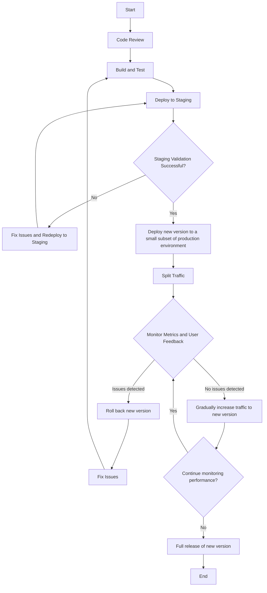

```mermaid
graph TD
  A[Start] --> B[Code Review]
  B --> C[Build and Test]
  C --> D[Deploy to Staging]
  D --> E{Staging Validation Successful?}
  E -->|No| F[Fix Issues and Redeploy to Staging]
  F --> D
  E -->|Yes| G[Deploy new version to a small subset of production environment]
  G --> H[Split Traffic]
  H --> I{Monitor Metrics and User Feedback}
  I -->|Issues detected| J[Roll back new version]
  J --> K[Fix Issues]
  K --> C
  I -->|No issues detected| L[Gradually increase traffic to new version]
  L --> M{Continue monitoring performance?}
  M -->|Yes| I
  M -->|No| N[Full release of new version]
  N --> O[End]
```
