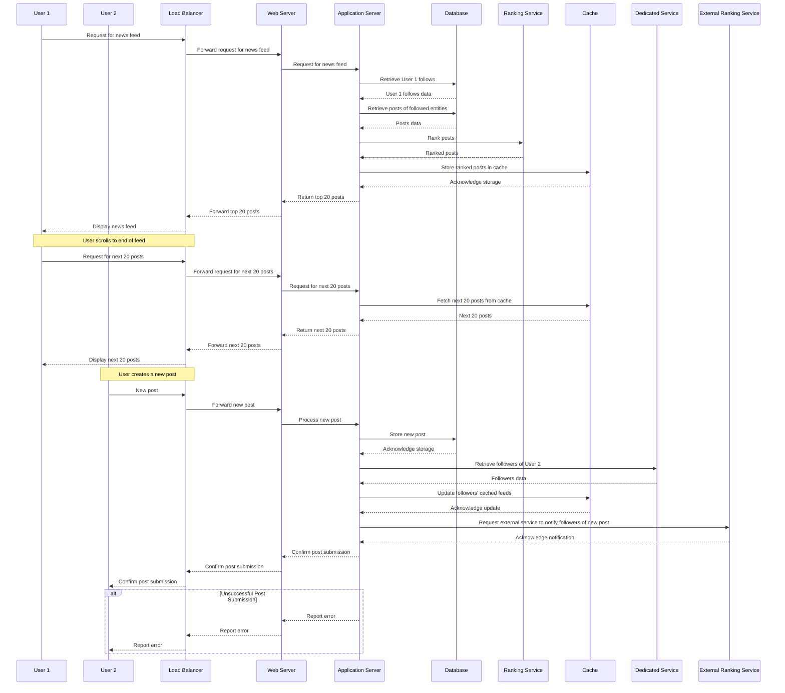

- Note
A web server accepts and fulfills requests from clients for static content (i.e., HTML pages, files, images, and videos) from a website. Web servers handle HTTP requests and responses only.

An application server exposes business logic to the clients, which generates dynamic content. It is a software framework that transforms data to provide the specialized functionality offered by a business, service, or application. Application servers enhance the interactive parts of a website that can appear differently depending on the context of the request.

The illustration below highlights the difference in their architecture:

svg viewer

The columns below summarize the key differences between the two types of servers:

Web Server
Deliver static content.
Content is delivered using the HTTP protocol only.

Serves only web-based applications.
No support for multi-threading.

Facilitates web traffic that is not very resource intensive.
Application Server
Delivers dynamic content.
Provides business logic to application programs using several protocols (including HTTP).
Can serve web and enterprise-based applications.
Uses multi-threading to support multiple requests in parallel.
Facilitates longer running processes that are very resource-intensive​.
