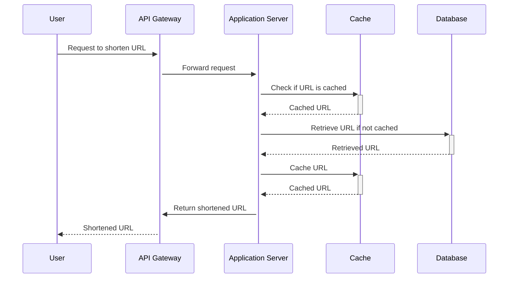

```mermaid
sequenceDiagram
  participant User
  participant API Gateway
  participant Application Server
  participant Cache
  participant Database

  User->>+API Gateway: Request to shorten URL
  API Gateway->>+Application Server: Forward request
  Application Server->>+Cache: Check if URL is cached
  Cache-->>-Application Server: Cached URL
  Application Server->>+Database: Retrieve URL if not cached
  Database-->>-Application Server: Retrieved URL
  Application Server->>+Cache: Cache URL
  Cache-->>-Application Server: Cached URL
  Application Server->>API Gateway: Return shortened URL
  API Gateway-->>User: Shortened URL
```
