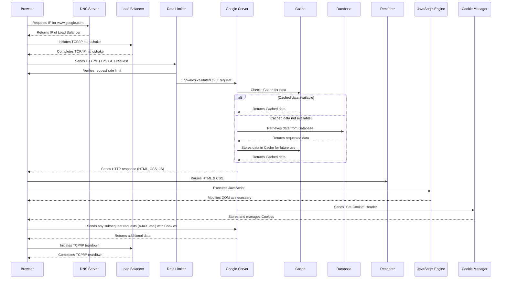

## What happens when you visit google.com from browser?

1. **DNS Lookup:** Same as before, the browser begins by translating "www.google.com" into an IP address using the DNS.

2. **Load Balancing:** The IP address obtained from DNS doesn't point directly to a single server but rather to a Load Balancer. Google's infrastructure includes many servers, and the load balancer distributes network or application traffic across these servers to ensure no single server becomes overwhelmed and to increase availability and reliability.

3. **Rate Limiting:** Load balancers or servers can also have a rate limiter in place to control the amount of incoming requests a user can send in a given amount of time. This is used to prevent abuse, DDoS attacks, and to ensure service availability. If a rate limiter was triggered, you'd receive an error message back at this point.

4. **TCP/IP Three-Way Handshake:** The same handshake process then happens between your browser and Google's load balancer or server.

5. **HTTP/HTTPS Request:** The client sends an HTTP GET request, with HTTPS used for secure communication.

6. **Server-Side Processing and Caching:** Google's servers receive the HTTP GET request. The requested data may be served from the cache if it's a commonly requested or static page, speeding up the process. Cache systems can be distributed and placed at various points in the system design, for instance, Content Delivery Network (CDN), Reverse Proxy or even at Database level (like Redis).

7. **HTTP/HTTPS Response:** The server responds to the GET request with the HTTP response. The response contains the website content and may contain a "Set-Cookie" HTTP header to manage user sessions.

8. **Web Rendering and JavaScript Execution:** After receiving the response, the client's browser parses, renders the page, and executes JavaScript as before.

9. **Cookies and Sessions:** HTTP Cookies set by the server are stored and managed by the client.

10. **TCP Connection Teardown:** After all resources are loaded and scripts are executed, the TCP connection is terminated.

This is a broader and more complex system design view that includes load balancing, rate limiting, and caching. However, there can still be even more layers of complexity when you get into the specifics of Google's architecture. It's a global, multi-tiered system that involves numerous data centers, networks, servers, and software components all working together to deliver high-speed, reliable, and secure web services.
